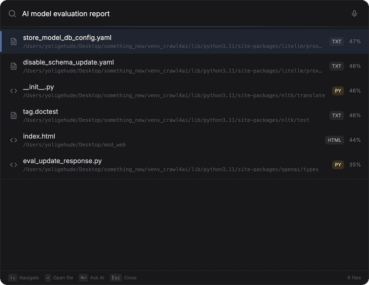

<p align="center">
  <h1 align="center">OpenFiles</h1>
  <p align="center">
    <strong>Open-source AI assistant for your local files.</strong><br>
    Search by meaning. Chat with citations. 100% local with Ollama.
  </p>
  <p align="center">
    <a href="https://github.com/yoligehude14753/openfiles/stargazers"></a>
    <a href="https://github.com/yoligehude14753/openfiles/blob/main/LICENSE"></a>
    <a href="https://github.com/yoligehude14753/openfiles/actions"></a>
    
    
  </p>
  <p align="center">
    <a href="https://github.com/yoligehude14753/openfiles/releases/latest"><strong>Download .dmg</strong></a> &middot;
    <a href="#quick-start">Quick Start</a> &middot;
    <a href="#features">Features</a> &middot;
    <a href="#how-it-works">How It Works</a> &middot;
    <a href="README_zh.md">中文</a>
  </p>
</p>

<p align="center">
  
</p>

> **Spotlight searches filenames. OpenFiles searches meaning.**
>
> Type _"find my Q4 budget report"_ — OpenFiles finds the right PDF by understanding its content, then answers follow-up questions with source citations.

## Quick Start

Get running in 30 seconds:

```bash
git clone https://github.com/yoligehude14753/openfiles.git
cd openfiles
cp .env.example .env
docker compose up
```

Open [http://localhost:3000](http://localhost:3000) and start searching.

> Uses [Ollama](https://ollama.com) by default — no API keys, nothing leaves your machine.

## Features

| | |
|---|---|
| **Search by meaning** | Describe what you're looking for. OpenFiles finds files by content, not filenames. |
| **Chat with your files** | Ask questions, get AI answers citing specific documents. |
| **27 file types** | PDFs, Word, Excel, PowerPoint, images, code, markdown, and more. |
| **Hybrid search** | 70% semantic vectors + 30% keyword matching for precise retrieval. |
| **Real-time indexing** | File watcher auto-indexes new and changed files. |
| **Any LLM** | Ollama (local), OpenAI, Claude, or any OpenAI-compatible API. |
| **Privacy-first** | Files stay on your machine. SQLite only — no Postgres, no Redis, no vector DB. |

## How It Works

```
  "find my Q4 budget report"
            │
            ▼
   ┌─────────────────┐
   │  Hybrid Search   │  70% semantic + 30% keyword
   │  (numpy + SQL)   │
   └────────┬────────┘
            │
   ┌────────▼────────┐
   │   RAG Engine     │  retrieves relevant chunks
   │   + LLM (Ollama) │  generates answer with citations
   └────────┬────────┘
            │
            ▼
   "Found in Q4-Strategy.pdf (p.3):
    Revenue grew 23% YoY..."
```

**Stack:** Python/FastAPI backend, React/TypeScript frontend, SQLite + numpy vectors, Ollama.

## Use Cases

**"I remember the content, but not the filename"**
> Describe what you're looking for in plain English. OpenFiles finds matching files by understanding their content.

**"Summarize what matters across multiple files"**
> Ask a question that spans several documents. Get a single answer with citations.

**"Where does this concept appear in my codebase?"**
> Search code, docs, and configs semantically — not just grep.

## Supported File Types

| Category | Formats |
|----------|---------|
| Documents | PDF, DOCX, DOC, TXT, RTF, Markdown |
| Spreadsheets | XLSX, XLS, CSV |
| Presentations | PPTX, PPT |
| Images | JPG, PNG, GIF, WebP, SVG, TIFF |
| Code | Python, JavaScript, TypeScript, Java, C/C++, HTML, CSS, JSON, YAML |

## Configuration

```bash
# Default: Ollama (local, no API key)
LLM_PROVIDER=ollama
EMBEDDING_PROVIDER=ollama

# Or any OpenAI-compatible API
LLM_PROVIDER=openai-compatible
OPENAI_COMPATIBLE_API_KEY=sk-your-key
OPENAI_COMPATIBLE_BASE_URL=https://api.example.com/v1

# Directories to index
SCAN_DIRECTORIES=~/Documents,~/Desktop,~/Downloads
```

See [.env.example](.env.example) for all options.

## CLI

```bash
python main.py init          # Initialize database
python main.py index         # Index configured directories
python main.py search "..."  # Search from terminal
python main.py serve         # Start the web server
```

## API

REST + WebSocket API with [Swagger UI](http://localhost:8000/docs):

| Endpoint | Method | Description |
|----------|--------|-------------|
| `/api/v1/search` | POST | Semantic file search |
| `/api/v1/chat` | POST | Send a chat message |
| `/api/v1/chat/stream` | WS | Stream chat responses |
| `/api/v1/files` | GET | List indexed files |
| `/api/v1/index` | POST | Trigger indexing |
| `/api/v1/stats` | GET | Get statistics |

## Manual Setup

```bash
git clone https://github.com/yoligehude14753/openfiles.git && cd openfiles
./setup.sh

# Terminal 1 — Backend
source venv/bin/activate && python main.py serve

# Terminal 2 — Frontend
cd frontend && npm run dev
```

**Prerequisites:** Python 3.9+, Node.js 18+, [Ollama](https://ollama.com) (recommended)

## Roadmap

- [x] RAG chat with file citations
- [x] Hybrid search (vector + keyword)
- [x] Real-time file watcher
- [x] 27 file type parsers
- [x] Ollama / OpenAI / Claude support
- [x] Dark mode + i18n (EN/中文)
- [ ] Voice input (OpenAI Realtime API)
- [ ] Desktop app (Tauri) with Spotlight-style UX
- [ ] Plugin system for custom parsers
- [ ] Multi-user support

## Contributing

Contributions welcome! See [CONTRIBUTING.md](CONTRIBUTING.md).

## License

[MIT](LICENSE)

---

<p align="center">
  If OpenFiles helps you find what you're looking for, consider giving it a <a href="https://github.com/yoligehude14753/openfiles">star</a>.
</p>
